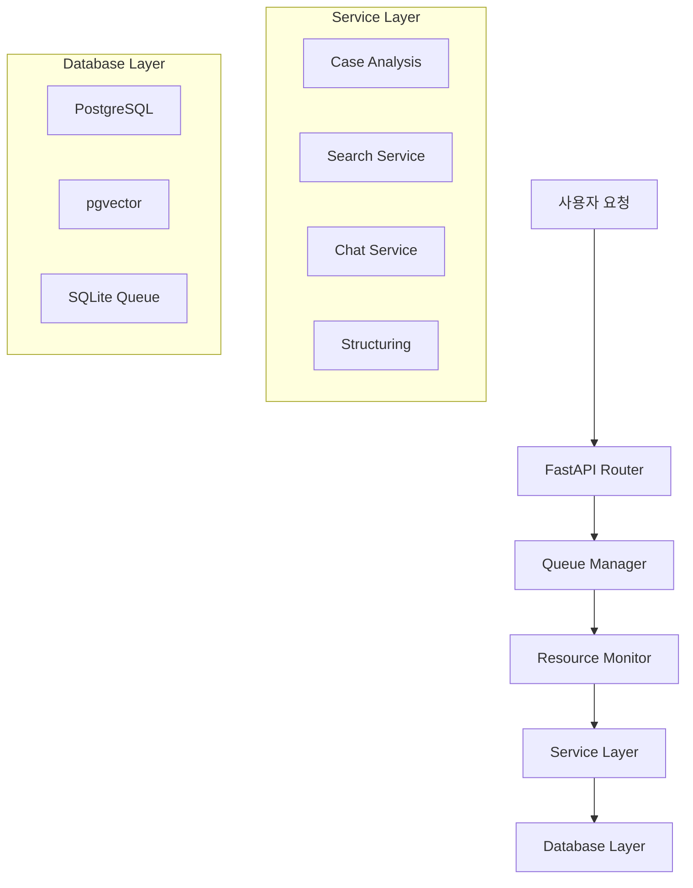

# 🏛️ ALaw AI-Backend

> **AI 기반 화상 법률 상담 플랫폼**의 핵심 AI 백엔드 서비스

사용자의 사건 개요를 분석하고, 법률 정보를 검색하며, 변호사와의 상담을 효율적으로 지원하는 **AI 기반 API 서버**입니다.

[](https://fastapi.tiangolo.com/)
[](https://python.org)
[](https://github.com/pgvector/pgvector)
[](LICENSE)

---

## 🚀 빠른 시작

### 📋 요구사항
- Python 3.10+
- PostgreSQL with pgvector extension
- OpenAI API 키

### ⚡ 설치 및 실행

```bash
# 1. 리포지토리 클론
git clone https://github.com/your-repo/ALaw-AI-Backend.git
cd ALaw-AI-Backend

# 2. 가상환경 생성 및 활성화
conda env create -f environment.yml
conda activate alaw-ai

# 3. 환경 변수 설정
cp config/.env.example config/.env
# config/.env 파일에 OpenAI API 키 등 설정

# 4. 서버 실행
uvicorn app.main:app --host 0.0.0.0 --port 8000 --reload
```

### 🐳 Docker로 실행

```bash
# 데이터베이스 실행
cd db && docker-compose up -d

# AI 애플리케이션 실행
cd docker && docker-compose up -d --build

# 서비스 확인
curl http://localhost:8997/
```

**🌐 라이브 데모**: [http://122.38.210.80:8997/](http://122.38.210.80:8997/)

---

## ✨ 핵심 기능

### 🧠 AI 법률 분석
- **하이브리드 검색**: 키워드 + 벡터 검색으로 정확도 향상
- **3단계 고정밀도 검색**: 60개 → 15개 → 3개 단계별 필터링  
- **객관적 신뢰도 계산**: 30-95% 범위의 신뢰할 수 있는 분석
- **법령 검증 시스템**: 5,502개 법령 DB와 실시간 매칭

### 📝 스마트 문서 처리
- **사건 구조화**: 자유 텍스트 → 표준 법률 스키마
- **상담 신청서 생성**: 분석 결과 기반 자동 생성
- **핵심 질문 도출**: 변호사를 위한 맞춤형 질문

### 💬 실시간 상호작용
- **법률 챗봇**: SSE 기반 실시간 스트리밍 대화
- **큐 시스템**: 리소스 제약 환경 최적화

---

## 🏗️ 아키텍처



### 🔧 기술 스택

| 분야 | 기술 |
|------|------|
| **Framework** | FastAPI, Pydantic |
| **AI/LLM** | OpenAI GPT-4o, LangChain, Sentence-Transformers, rank-bm25, Kiwipiepy |
| **Database** | PostgreSQL, pgvector, SQLite |
| **Deployment** | Docker, Uvicorn |
| **Testing** | Pytest |

---

## 📚 문서

| 문서 | 설명 |
|------|------|
| [🏗️ 아키텍처 가이드](docs/ARCHITECTURE.md) | 시스템 설계 및 구조 |
| [🚀 배포 가이드](docs/DEPLOYMENT.md) | Docker 및 프로덕션 배포 |
| [🔧 API 문서](docs/API.md) | REST API 엔드포인트 |
| [⚙️ 개발 가이드](docs/DEVELOPMENT.md) | 개발 환경 설정 |
| [🧪 테스트 가이드](docs/TESTING.md) | 테스트 실행 및 작성 |
| [📊 운영 가이드](docs/OPERATIONS.md) | 모니터링 및 장애 대응 |

---

## 🧪 테스트

```bash
# 전체 테스트 실행
pytest

# 개발 의존성 포함 설치
pip install -r requirements-dev.txt

# 커버리지 포함 테스트
coverage run -m pytest && coverage report
```

---

## 🚀 배포

### 로컬 개발
```bash
uvicorn app.main:app --reload
```

### 프로덕션
- **자동 배포**: `dev-AI` 브랜치 푸시 시 GitLab CI/CD 자동 실행
- **배포 시간**: 15-20분 (AI 모델 로딩 포함)
- **모니터링**: Mattermost 실시간 알림

자세한 내용은 [배포 가이드](docs/DEPLOYMENT.md)를 참조하세요.

---
## 🚧 현재의 기술적 과제 (Current Challenges)

### 🎯 RAG 검색 정확도 개선
- **현재 상태**: BM25 도입으로 Recall@10 55%를 달성했으나, 상위 순위 정확도(Recall@1 15%, MRR 0.250) 개선이 필요합니다.
- **해결 방안**: Cross-Encoder 재정렬(reranking) 강화, 법률 도메인 특화 임베딩 모델 파인튜닝을 검토 중입니다.

### 💬 대화의 일관성 유지
- **현재 상태**: 다수의 동시 사용자가 각자의 대화 맥락을 독립적으로 유지하며 일관성 있는 답변을 받도록 하는 시스템 필요
- **해결 방안**: 현재의 인메모리 기반 대화 기록 방식을 `Redis`와 같은 외부 세션 저장소로 확장하는 방안을 검토 중

### 🔧 배포 환경 이중화
- **현재 상태**: 단일 서버 배포 환경
- **해결 방안**: 고가용성(HA) 구성으로 확장하여 무중단 서비스 제공 및 부하 분산 체계 구축이 필요

---

## 👨‍💻 개발자

**AI Backend Developer & DevOps Engineer**

- 🧠 **AI 시스템 아키텍처**: 하이브리드 검색, 법령 검증, 신뢰도 계산
- 🔍 **검색 최적화**: 키워드+벡터 하이브리드, 3단계 고정밀도 검색
- ⚙️ **DevOps**: Docker, CI/CD, 자동 배포, 모니터링
- 🛠️ **최적화**: 리소스 제약 환경 대응 큐 시스템

자세한 기여 내용은 [기여 문서](docs/CONTRIBUTIONS.md)를 참조하세요.

[](https://github.com/grayson1999)
